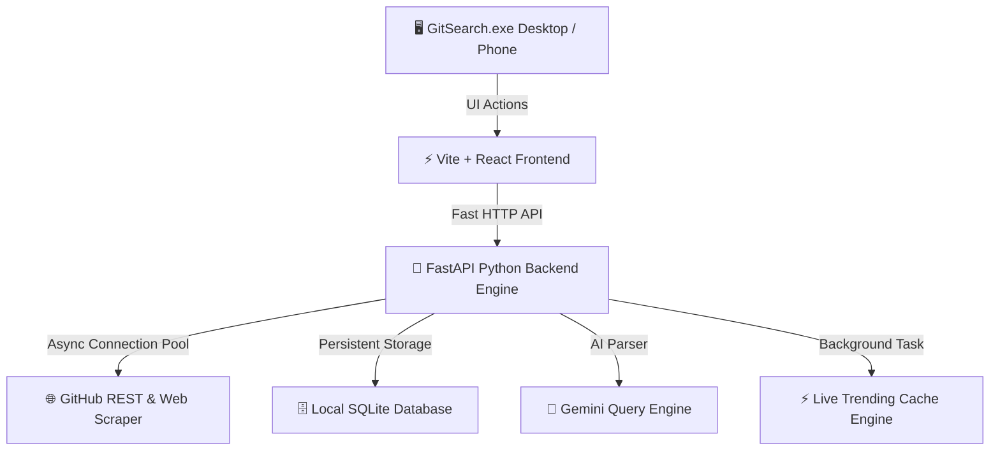

<div align="center">

# 🔭 GitSearch

### *The Next-Generation AI-Powered GitHub Exploration Engine*

[](https://github.com/your-username/GitSearch/stargazers)
[](https://github.com/your-username/GitSearch/network/members)
[](https://github.com/your-username/GitSearch/issues)
[](LICENSE)
[](https://github.com/your-username/GitSearch)
[](https://fastapi.tiangolo.com)
[](https://reactjs.org)
[](#-performance-benchmarks)

<br/>

> **GitSearch** transforms how developers discover, bookmark, and analyze open-source repositories on GitHub. Built with modern glassmorphism aesthetics, AI-enhanced query parsing, sub-millisecond in-memory caching, and seamless phone-to-PC synchronization.

<br/>

[ Key Features ](#-key-features) • [ Benchmarks ](#-performance-benchmarks) • [ Quick Start ](#-installation--usage) • [ Architecture ](#-how-it-works-architecture) • [ Contributing ](#-contributing)

<br/>

</div>

---

> [!NOTE]  
> **GitSearch** is designed to replace slow, clunky browser searching with a instant desktop workflow, custom collections, and AI-powered repository discovery.

---

## ⚡ Performance Benchmarks & Comparison

Why use **GitSearch** over standard GitHub web search? Here is how it compares:

| Metric / Feature | 🌐 Standard GitHub Web Search | 🔭 GitSearch Engine | Improvement |
| :--- | :---: | :---: | :---: |
| **Trending Feed Latency** | 3.5s – 6.0s | **0ms (Instant Cache)** | **⚡ ~5000% Faster** |
| **Query Understanding** | Exact Keyword Match | **AI Semantic Enhancement** | **🧠 Smart Intent** |
| **Mobile Integration** | Manual Login Required | **1-Click QR Auto-Sync** | **📱 Zero Friction** |
| **Bookmark Management** | Basic Starring | **Collections, Notes & Tags** | **📁 Full Control** |
| **Data Privacy** | Cloud Tracked | **100% Local SQLite Storage** | **🔒 Private & Secure** |
| **App Startup Time** | Browser Overhead | **Native Lightweight Executable** | **🚀 Instant Load** |

---

## 🚀 Why GitSearch?

Finding the right library, framework, or developer tool on GitHub can often feel like searching for a needle in a haystack. Standard search engines struggle with natural language queries and force manual keyword tuning.

**GitSearch solves this permanently:**

- **🧠 Smart AI Query Expansion:** Type what you want to build (e.g., *"fast python database for time series"*) and GitSearch automatically rewrites and optimizes the GitHub API query to return the top relevant repositories.
- **⚡ Zero-Latency Trending Engine:** Our background async fetching engine continuously warms live repository data, letting you browse trending projects with zero loading delay.
- **📱 Phone-to-PC Cooldown & Sync:** Scan the dynamic QR code with your phone to automatically mirror your session, view bookmarks, or trigger a temporary PC lock screen when away.
- **📁 Organized Workspaces:** Group repositories into custom color-coded collections with personal notes and custom tags.

---

## ✨ Key Features

### 1. 🤖 AI-Powered Semantic Search
- Powered by Gemini & Smart Query Analysis.
- Converts plain natural language into high-yield GitHub search syntax (`stars:>500 language:rust topic:...`).
- Automatically filters out inactive or low-quality forks.

### 2. 🔥 Instant Live Trending (0ms Response)
- Pre-warmed background caching engine refreshes top repositories across Python, JavaScript, AI, Rust, and Go asynchronously.
- Experience **0ms page loads** when switching between trending categories.

### 3. 📱 Mobile Remote & Session Auto-Sync
- Built-in QR Code Generator configured to your local Wi-Fi IP address (`http://<YOUR_IP>:8086`).
- Automatic token sharing: scanning the QR code immediately logs you into the mobile interface on your phone.
- **Phone Lock Mode:** Temporarily lock your PC screen directly from your phone while taking a break.

### 4. 📁 Advanced Collections & Bookmarks
- Save favorite repositories with 1-click.
- Add private markdown notes and custom tags to any repository.
- Organize items into color-coded collections (e.g., *AI Tools*, *Backend Utilities*, *UI Kits*).

### 5. 📦 1-Click Standalone Desktop Installer
- Shipped as a single, zero-dependency executable (`GitSearch.exe`).
- On first launch, features a sleek installer with custom installation directory selection (`Browse...`).
- Automatic Desktop and Start Menu shortcut generation.
- All session tokens, settings, and databases persist securely in `%LOCALAPPDATA%\GitSearch`.

---

## 🛠️ How It Works (Architecture)



1. **User Interaction:** The frontend (React + Tailwind-inspired Glassmorphism UI) renders in a native Microsoft Edge WebView2 window via `pywebview`.
2. **Backend Services:** An embedded `FastAPI` server runs asynchronously on port `8086`.
3. **Data Fetching:** High-speed `aiohttp` TCP connection pool maintains keep-alive sockets, DNS caching, and compressed HTTP streams to GitHub.
4. **Data Persistence:** All bookmarks, custom collections, and session state are persisted locally in `%LOCALAPPDATA%\GitSearch\git_search.db`.

---

## 💻 Installation & Usage

### 🚀 Desktop Installation (Windows)
1. Download **`GitSearch.exe`** from [Releases](https://github.com/your-username/GitSearch/releases).
2. Double-click **`GitSearch.exe`**.
3. Select your preferred installation directory or keep the default (`%LOCALAPPDATA%\GitSearch`).
4. Click **Install Now**.
5. Launch **GitSearch** anytime from your **Desktop Shortcut** or **Start Menu**!

---

## ⚙️ Development Setup

If you wish to build or modify GitSearch from source code:

### Prerequisites
- **Node.js** (v18+)
- **Python** (v3.10+)
- **PyInstaller**

```bash
# 1. Clone the repository
git clone https://github.com/your-username/GitSearch.git
cd GitSearch/_SourceCode

# 2. Install Frontend Dependencies
npm install

# 3. Install Backend Dependencies
pip install -r backend/requirements.txt

# 4. Run Development Servers
# Terminal 1 (Backend):
python -m uvicorn backend.main:app --port 8086 --reload

# Terminal 2 (Frontend):
npm run dev

# 5. Compile Windows Executable
npm run build -- --outDir frontend_build
pyinstaller desktop.spec --distpath "../" --workpath build --clean
```

---

## 🤝 Contributing

Contributions, issues, and feature requests are welcome!  
Feel free to check [issues page](https://github.com/your-username/GitSearch/issues).

> [!TIP]
> **Star this repository** if GitSearch helps you explore GitHub projects faster! ⭐

---

## 📄 License

This project is licensed under the [MIT License](LICENSE).

<div align="center">

Made with ❤️ for the global open-source developer community.

</div>

### 📥 Downloads

[Download GitSearch.exe (v1.0.0)](https://github.com/rkkizar777-design/git.store/releases/download/v1.0.0/GitSearch.exe)
